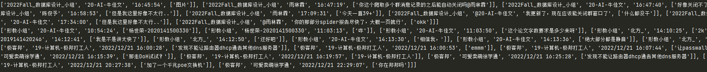

# QQcrawl
## 使用方法
运行`main.py` 即可
## 适用条件
**打开QQ即可，可以缩小在后台
## 爬取不同的群
``` python
    grouptext = ["2022Fall_数据库设计_小组","形教小组","极客邦"]        #  需要爬取的群组 确保提前打开
    qq =QQhandle()

    qq.crawl(grouptext)
    result1,result2,result3 = qq.results  # 最后的列表结果
    print(result1[-10:])
    print(result2[-10:])
    print(result3[-10:])
```
修改grouptext即可
## 运行结果
一个是`txt` 文档  

